# DSO202 Practical 1 Report


**Module:** DSO202 — Scaling, Orchestration, Monitoring & Observability

**Practical:** Practical 1 — Setting Up a Local Kubernetes Cluster with kind and Deploying First Workloads

**Student:** Sonam Dorji Ghalley

**Student Number** 02230299

---

# 1. Objective

The objective of this practical was to establish a local Kubernetes environment using **kind (Kubernetes IN Docker)** and develop practical experience with the fundamental components and operations of Kubernetes.

The practical involved creating a three-node Kubernetes cluster consisting of one control-plane node and two worker nodes. The cluster was then used to create and manage namespaces, resource quotas, limit ranges, Pods, Deployments and Services.

The practical also aimed to develop familiarity with the `kubectl` command-line interface for inspecting resources, troubleshooting workloads, scaling applications, performing rolling updates and rollbacks, testing Kubernetes networking, and demonstrating the self-healing behaviour of Kubernetes.

The practical addressed the following areas of Unit I:

* Kubernetes architecture and cluster components;
* Pods and containerised workloads;
* ReplicaSets and Deployments;
* Kubernetes Services;
* `kubectl` operations and troubleshooting;
* resource management;
* namespaces and multi-tenancy; and
* declarative configuration using YAML manifests.

---

# 2. Environment

The practical was completed on a local macOS computer using Docker Desktop, kind and kubectl.

| Component          | Environment Used                                |
| ------------------ | ----------------------------------------------- |
| Operating System   | macOS               |
| Cluster Name       | `dso202`                                        |
| Control Plane      | `control-plane`                                 |
| Worker Nodes       | `worker-node-1`, `worker-node-2`                |
| Application Image  | `nginx:1.30-alpine`                             |
| Update Image       | `nginx:1.31-alpine`                             |
| Client Image       | `busybox:1.37`                                  |

The required software was first verified.

```bash
docker info --format '{{.ServerVersion}} {{.OperatingSystem}}'
kind version
kubectl version --client
```

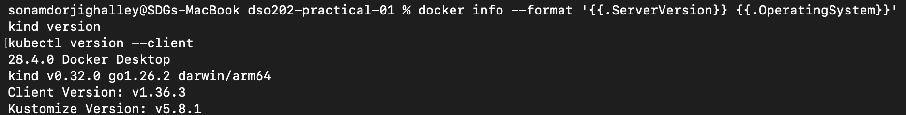

**Figure 1. Verification of Docker, kind and kubectl installation.**

The output confirmed that the required tools were installed and available before the Kubernetes cluster was created.

---

# 3. Procedure and Observations

## 3.1 Stage 0 — Prerequisites and Verification

The practical repository was organised using separate directories for cluster configuration, Kubernetes manifests, evidence and the final report.

The software environment was verified using Docker, kind and kubectl version commands. Successful responses from all three commands confirmed that the environment was ready for cluster creation.

The repository was structured as follows:

```text
dso202-practical-01/
├── README.md
├── cluster
│   ├── kind-cluster-fallback.yaml
│   └── kind-cluster.yaml
├── evidence
│   ├── final-state-all.txt
│   ├── final-state-events.txt
│   ├── final-state-nodes.txt
│   ├── final-state-resources.txt
│   └── web-imperative-as-stored.yaml
├── manifests
│   ├── 00-namespace.yaml
│   ├── 01-quota-and-limits.yaml
│   ├── 02-pod-web.yaml
│   ├── 03-deployment-web.yaml
│   ├── 04-service-clusterip.yaml
│   ├── 05-service-nodeport.yaml
│   └── 06-pod-client.yaml
└── report
    └── practical-01-report.md
```

The successful software verification shown in Figure 1 confirmed that the practical could proceed.

---

## 3.2 Stage 1 — Creating the Three-Node Cluster

The cluster configuration supplied in the companion manifest file was saved as:

```text
cluster/kind-cluster.yaml
```

The cluster was created using:

```bash
kind create cluster --config cluster/kind-cluster.yaml
```


The output showed the preparation of the nodes, creation of the control plane, installation of the Container Network Interface (CNI), installation of the StorageClass and joining of the worker nodes.

The cluster and underlying Docker containers were then verified using:

```bash
kind get clusters
kind get nodes --name dso202
docker ps --format 'table {{.Names}}\t{{.Image}}\t{{.Status}}'
kubectl config current-context
```

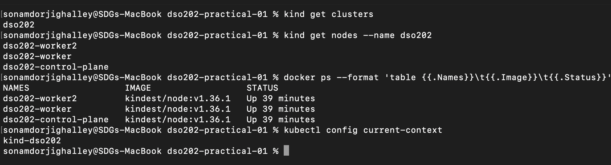

**Figure 2. Verification of the kind cluster, Docker containers and kubectl context.**

The output confirmed that the `dso202` cluster existed and consisted of three Docker-based Kubernetes nodes. The current kubectl context was also correctly set to the newly created cluster.

---

## 3.3 Stage 2 — Inspecting the Cluster and Its Components

The Kubernetes nodes were inspected using:

```bash
kubectl get nodes -o wide
```

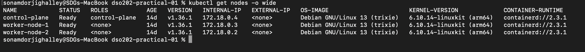

**Figure 3. Kubernetes nodes reporting a Ready status.**

The control-plane node and both worker nodes reported a `Ready` status, confirming that the cluster was operational. The wide output also displayed node IP addresses, Kubernetes versions and container runtime information.

The core Kubernetes system components were then inspected:

```bash
kubectl get pods -n kube-system -o wide
```

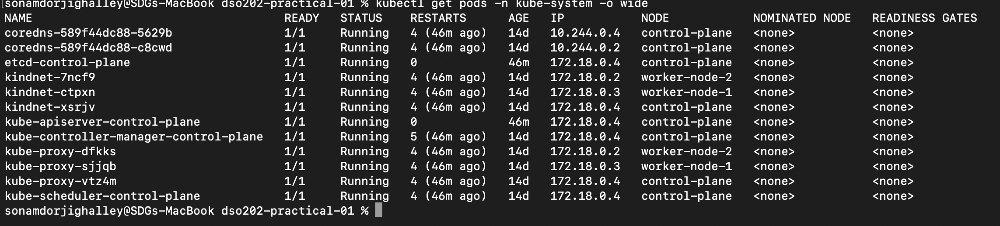

**Figure 4. Kubernetes system components running in the `kube-system` namespace.**

The output showed components including CoreDNS, etcd, kube-apiserver, kube-controller-manager, kube-scheduler, kube-proxy and kindnet. Control-plane components were located on the control-plane node, while components such as kube-proxy and kindnet were present across the cluster nodes.

This demonstrated that Kubernetes consists of several cooperating components rather than a single process.

---

## 3.4 Stage 3 — Namespaces, Resource Quotas and Limit Ranges

A temporary namespace was initially created and deleted using imperative kubectl commands to demonstrate imperative resource management.

The declarative namespace manifest was then applied, and `dso202-practical-01` was used as the working namespace.

```bash
kubectl apply -f manifests/00-namespace.yaml
kubectl config set-context --current --namespace=dso202-practical-01
```
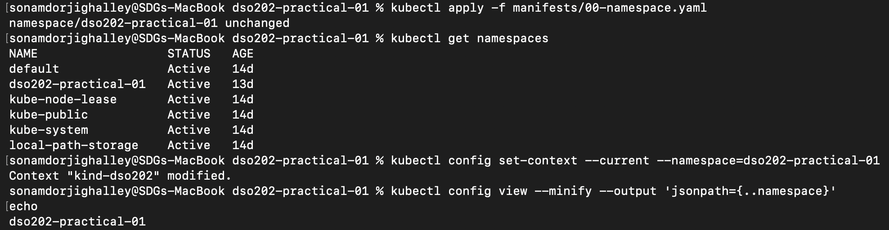

The namespace provided a logical boundary within which the practical workloads were created.

A ResourceQuota and LimitRange were then applied:

```bash
kubectl apply -f manifests/01-quota-and-limits.yaml
```

The ResourceQuota was inspected using:

```bash
kubectl describe resourcequota dso202-quota
```

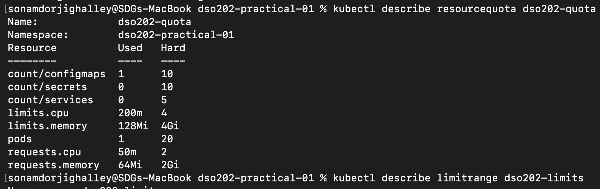

**Figure 7. ResourceQuota configured for the practical namespace.**

The ResourceQuota established maximum CPU, memory and object-count consumption within the namespace. The `Used` and `Hard` values provided a mechanism for monitoring current resource use against the configured maximum.

The LimitRange was inspected using:

```bash
kubectl describe limitrange dso202-limits
```

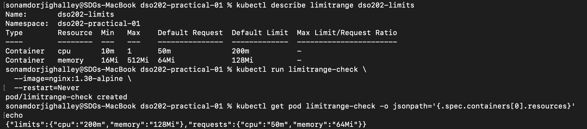

**Figure 8. CPU and memory defaults and limits defined by the LimitRange.**

The LimitRange provided default CPU and memory requests and limits for containers that did not explicitly specify them.

Its operation was verified by creating a temporary Pod without providing resource values.


**Figure 8. Verification that the LimitRange automatically supplied resource requests and limits.**

The stored Pod configuration contained CPU and memory requests and limits even though these values were omitted from the imperative command. This demonstrated the interaction between ResourceQuota and LimitRange.

---

## 3.5 Stage 4 — Pods

A web server Pod using `nginx:1.30-alpine` was first created imperatively and subsequently recreated using the declarative manifest:

```bash
kubectl apply -f manifests/02-pod-web.yaml
```

Applying the same manifest a second time returned an `unchanged` result, demonstrating the idempotent nature of declarative Kubernetes configuration.

The Pod was inspected using:

```bash
kubectl get pod web-pod -o wide --show-labels
```

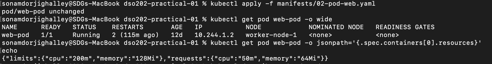


**Figure 10. Declaratively managed nginx Pod running successfully.**

The output showed that the Pod was `Running`, had been assigned a cluster-internal IP address, and had been scheduled onto one of the worker nodes. It also displayed the labels applied through the YAML manifest.

The Pod events were inspected using:

```bash
kubectl describe pod web-pod
```

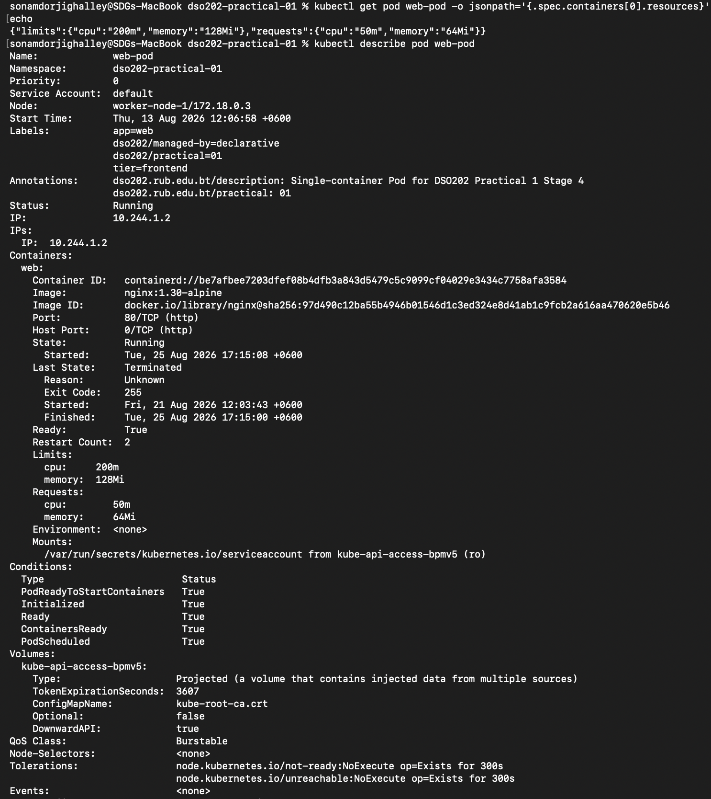

**Figure 11. Kubernetes event sequence for creation of the nginx Pod.**

The Events section showed the sequence of scheduling, image pulling, container creation and container startup. This demonstrated the respective roles of the Kubernetes scheduler and kubelet during Pod creation.

An interactive shell was opened inside the container using:

```bash
kubectl exec -it web-pod -- sh
```

Commands such as `hostname`, `cat /etc/os-release`, `ls` and `wget` were used to inspect and communicate with the nginx container.

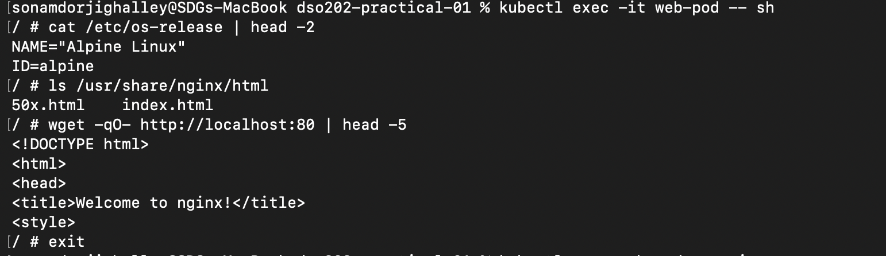

**Figure 12. Interactive access to the nginx container using `kubectl exec`.**

The successful commands confirmed that `kubectl exec` could be used to inspect and troubleshoot processes running inside a Pod.

A temporary port-forward was then established:

```bash
kubectl port-forward pod/web-pod 8080:80
```

The web server was accessed from another terminal using:

```bash
curl -s http://localhost:8080
```

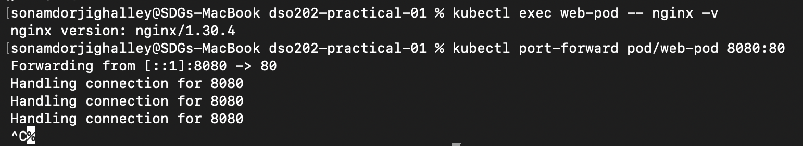

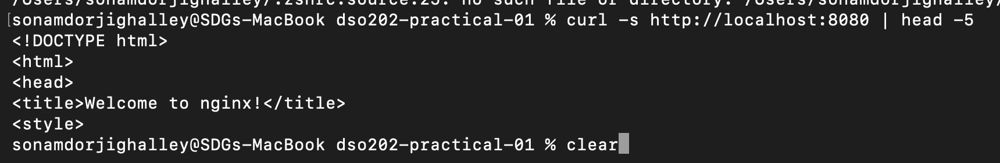

**Figure 13 and 13(a). Accessing the nginx Pod through kubectl port forwarding.**

The nginx HTML response confirmed successful communication between the local computer and the Pod through the Kubernetes API server.

---

## 3.6 Stage 5 — Deployments

A Deployment containing three nginx replicas was created using:

```bash
kubectl apply -f manifests/03-deployment-web.yaml
kubectl rollout status deployment/web-deployment
```

The Deployment, ReplicaSet and Pods were inspected:

```bash
kubectl get deployment,replicaset,pod -l app=web
```

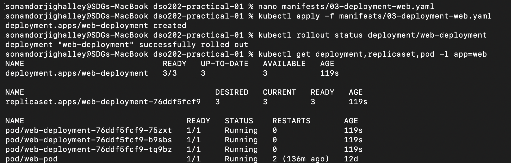

**Figure 14. Deployment, ReplicaSet and three running application Pods.**

The output demonstrated the Kubernetes ownership hierarchy:

```text
Deployment → ReplicaSet → Pods
```

The scheduler placed the Deployment Pods onto the available worker nodes.

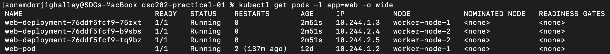

**Figure 15. Distribution of application Pods across Kubernetes worker nodes.**

This demonstrated that workload placement was performed by the Kubernetes scheduler rather than being manually assigned in the manifest.

### 3.6.1 Self-Healing

One of the Deployment-managed Pods was manually deleted.

```bash
kubectl delete pod <pod-name>
kubectl get pods -l app=web
```

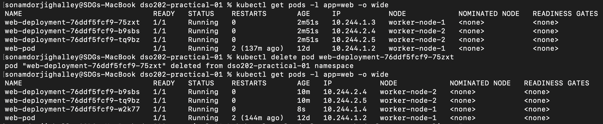

**Figure 16. Automatic replacement of a manually deleted Deployment Pod.**

A replacement Pod was automatically created with a new name. This occurred because the ReplicaSet continuously compared the actual number of running Pods with the desired replica count.

This experiment clearly demonstrated Kubernetes reconciliation and self-healing behaviour.

### 3.6.2 Scaling

The Deployment was scaled from three replicas to five using:

```bash
kubectl scale deployment web-deployment --replicas=5

```

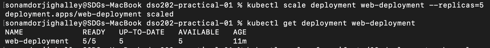

**Figure 17. Deployment successfully scaled from three to five replicas.**

The number of application Pods increased automatically to satisfy the new desired state.

The original declarative configuration was subsequently reapplied, returning the Deployment to three replicas. This demonstrated that the committed manifest remained the authoritative desired configuration.

### 3.6.3 Rolling Update and Rollback

A rolling update was performed by changing the nginx image from `nginx:1.30-alpine` to `nginx:1.31-alpine`.

```bash
kubectl set image deployment/web-deployment web=nginx:1.31-alpine
kubectl rollout status deployment/web-deployment
kubectl rollout history deployment/web-deployment
```

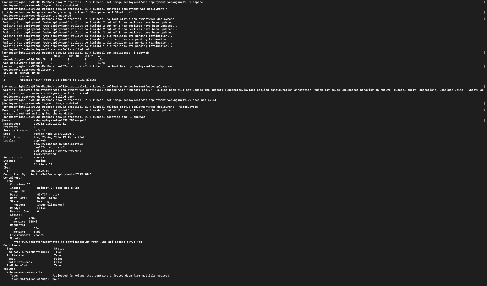

**Figure 18. Successful rolling update and creation of a new ReplicaSet.**

During the rollout, Kubernetes gradually created new Pods before removing the older Pods. The old ReplicaSet was retained at zero replicas, enabling rollback if necessary.

A deliberately invalid image was then configured:

```bash
kubectl set image deployment/web-deployment web=nginx:9.99-does-not-exist
```

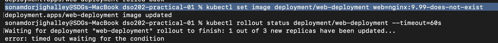

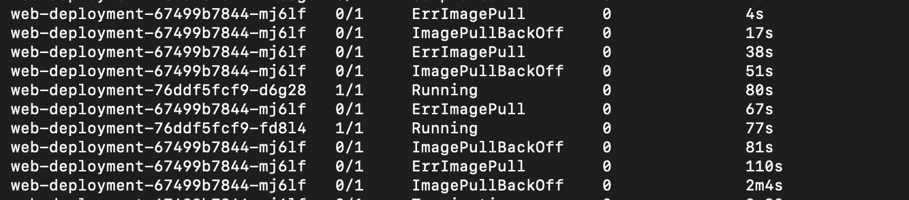

**Figure 19 19(a). Deliberately failed rollout resulting in `ImagePullBackOff`.**

The new Pod was unable to retrieve the nonexistent container image and entered the `ImagePullBackOff` state. Importantly, the healthy existing replicas remained operational because the Deployment strategy did not permit unavailable replicas during the rollout.

The failed rollout was recovered using:

```bash
kubectl rollout undo deployment/web-deployment
```

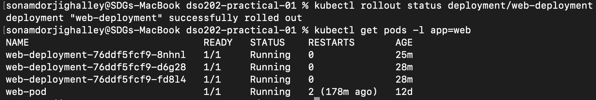

**Figure 20. Successful rollback from the failed nginx deployment.**

The Deployment returned to a healthy state with the required number of running Pods.

---

## 3.7 Stage 6 — Services

### 3.7.1 ClusterIP Service

A ClusterIP Service was created using:

```bash
kubectl apply -f manifests/04-service-clusterip.yaml
```

The corresponding EndpointSlice was inspected:

```bash
kubectl get endpointslice \
-l kubernetes.io/service-name=web-clusterip
```

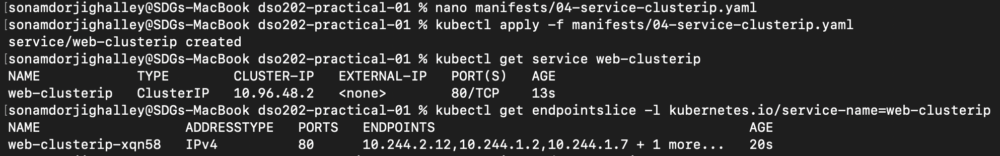

**Figure 21. ClusterIP Service and corresponding EndpointSlice.**

The Service provided a stable virtual address while the EndpointSlice contained the addresses of the ready backend Pods. This separated the client's destination from the temporary IP addresses of individual Pods.

A BusyBox client Pod was created to perform network tests from inside the cluster.

Kubernetes DNS was tested using:

```bash
kubectl exec client-pod -- nslookup web-clusterip
```

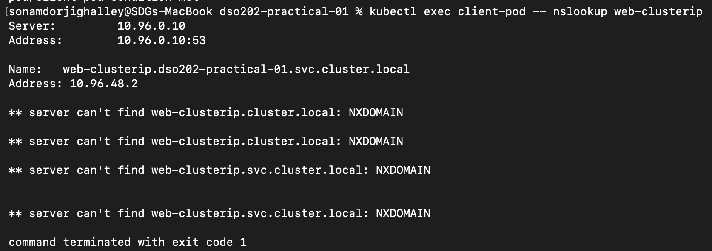

**Figure 22. Resolution of the ClusterIP Service using Kubernetes DNS.**

The successful DNS lookup demonstrated that Kubernetes automatically provides DNS-based service discovery.

HTTP connectivity was tested using:

```bash
kubectl exec client-pod -- wget -qO- http://web-clusterip
```

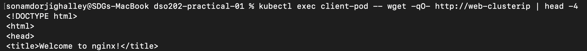

**Figure 23. HTTP communication with nginx through the ClusterIP Service.**

The successful nginx response confirmed that requests could be routed through the Service to the backend Pods.

### 3.7.2 Service Load Balancing

A different response containing each Pod's hostname was written to the nginx instances. Multiple requests were then sent through the Service.

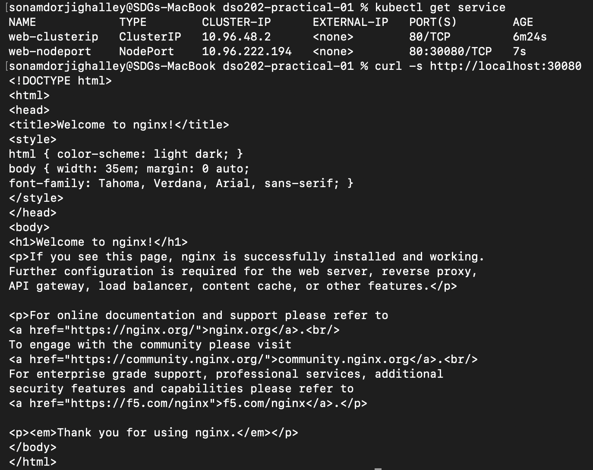

**Figure 24. Requests distributed across multiple nginx replicas.**

Responses were received from multiple Deployment Pods, demonstrating that the ClusterIP Service distributed connections between ready backend endpoints.

### 3.7.3 Readiness and Service Endpoints

The readiness condition of one nginx Pod was deliberately broken by removing its `index.html` file.

Although the Pod remained in the `Running` phase, its readiness condition changed and the Pod was removed from the Service EndpointSlice. This demonstrated the difference between a container being operational and being ready to receive application traffic.

Once the page was restored and the readiness check succeeded again, the Pod automatically returned to the EndpointSlice.

### 3.7.4 NodePort Service

A NodePort Service was created using:

```bash
kubectl apply -f manifests/05-service-nodeport.yaml
```

The Service exposed application port 80 through node port `30080`.

The application was accessed directly from the host:

```bash
curl -s http://localhost:30080
```

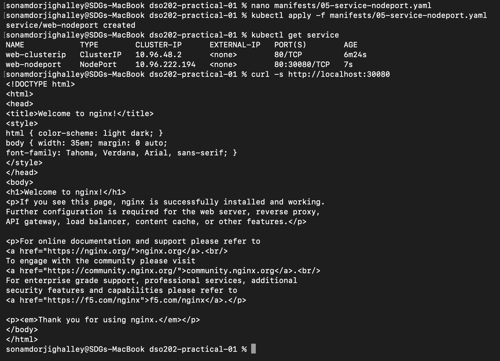

**Figure 26. Accessing the Kubernetes application from the host through NodePort 30080.**

The successful response demonstrated that NodePort can expose a Kubernetes Service outside the cluster without requiring `kubectl port-forward`.

---

## 3.8 Stage 7 — Evidence, Reproducibility and Cleanup

Before deleting the practical resources, the final Kubernetes state was recorded.

```bash
kubectl get all -o wide
```

Additional information was saved in the `evidence/` directory, including node state, resource information and events.

When the following event-capture command was executed:

```bash
kubectl get events --sort-by=.lastTimestamp \
> evidence/final-state-events.txt
```

the terminal returned:

```text
No resources found in dso202-practical-01 namespace.

```

This indicated that no Kubernetes Event objects were available in the namespace at that particular time. It did not indicate a cluster failure, because the workload state and other cluster resources remained accessible.

The workload resources were subsequently removed using their declarative YAML files.

The entire configuration was then recreated using a single command:

```bash
kubectl apply -f manifests/
```

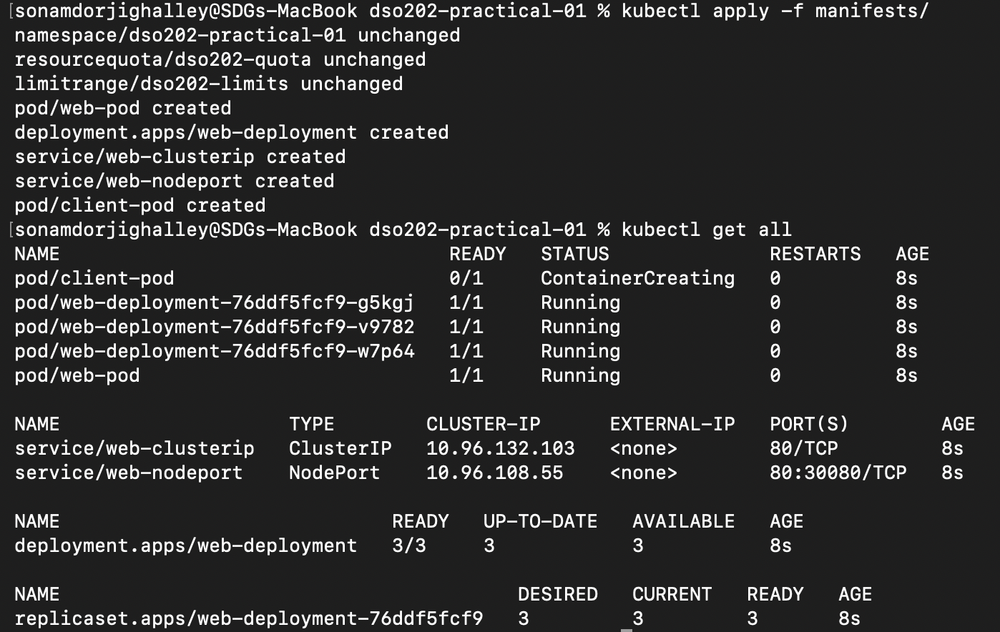

**Figure 28. Recreation of the practical environment from committed YAML manifests.**

The successful recreation of the Namespace, ResourceQuota, LimitRange, Pod, Deployment and Services demonstrated that the environment was reproducible from the repository rather than depending on manually configured resources in the running cluster.

Finally, the kubectl context was reset and the kind cluster was deleted:

```bash
kubectl config set-context --current --namespace=default
kind delete cluster --name dso202
kind get clusters
```

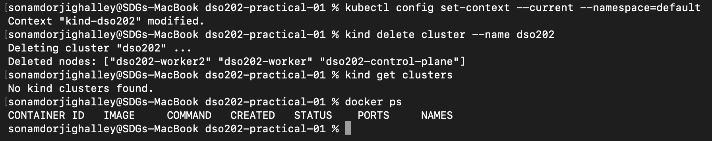

**Figure 29. Successful deletion and cleanup of the `dso202` cluster.**

The final output confirmed that no kind cluster remained, completing the cleanup stage.

---


# 4. Reflection

This practical provided practical experience with the relationship between Kubernetes cluster architecture, workloads, controllers and networking. Initially, working with several Kubernetes object types and understanding the difference between Docker container names, Kubernetes node names, Pods, ReplicaSets and Deployments required careful attention.

One issue encountered during the practical involved namespace consistency. The supplied materials contained references to both `dso202-practical` and `dso202-practical-01`. Since Kubernetes resources are namespace-scoped, inconsistent namespace names can cause commands to return `NotFound` or `No resources found` even when the resource exists in another namespace. To avoid this problem, `dso202-practical-01` was used consistently for the practical resources.

Another point of confusion occurred during final evidence collection when:

```bash
kubectl get events --sort-by=.lastTimestamp \
> evidence/final-state-events.txt
```

returned:

```text
No resources found in dso202-practical-01 namespace.
```

At first, this appeared to indicate a problem with the cluster. However, the workload and node state were checked independently, and the cluster resources were still operational. The output therefore indicated that no Event objects were available in the namespace at that particular time rather than indicating that the Kubernetes workloads had failed.

The deliberately failed rollout also provided an important troubleshooting exercise. Configuring:

```text
nginx:9.99-does-not-exist
```

caused a new Pod to enter `ImagePullBackOff`. The issue could be identified using:

```bash
kubectl get pods -l app=web
kubectl describe pod <pod-name>
```

The existing Pods remained healthy because of the Deployment's rolling-update behaviour. The workload was then restored using:

```bash
kubectl rollout undo deployment/web-deployment
```

This exercise demonstrated the importance of checking Pod status and events rather than assuming that a Deployment command has completed successfully.

If completing the practical again, I would maintain a terminal log and evidence directory from the beginning and capture important outputs immediately after each stage. This would reduce the need to return to earlier steps when preparing the report. I would also validate manifest namespace names and file paths before applying them to avoid configuration inconsistencies.

The area that I would like to understand further is how the Kubernetes networking demonstrated in this local kind environment changes in a production multi-host or cloud-based Kubernetes cluster, particularly how NodePort, LoadBalancer, Ingress and external networking operate together.

Overall, the practical demonstrated that Kubernetes continuously reconciles actual cluster state with the desired state defined by controllers and declarative manifests. The self-healing, scaling, rolling-update, readiness and Service experiments made this behaviour directly observable rather than only theoretical.

---

# 5. References

DSO202 (2026), *Practical 1 — Setting Up a Local Kubernetes Cluster with kind, and Deploying First Workloads*, DSO202 — Scaling, Orchestration, Monitoring & Observability, HackMD practical guide, accessed 18 August 2026.

DSO202 (2026), *Practical 1 Companion File: YAML Definitions*, HackMD manifest file, accessed 18 August 2026.
